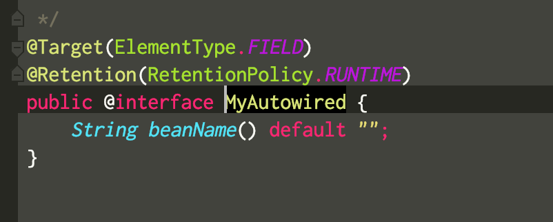
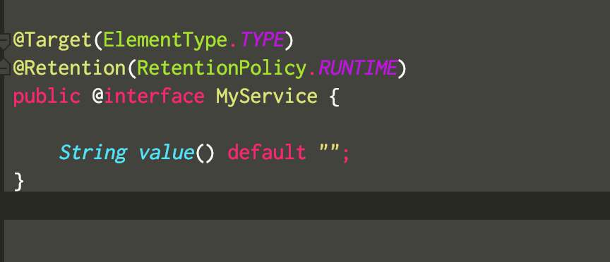
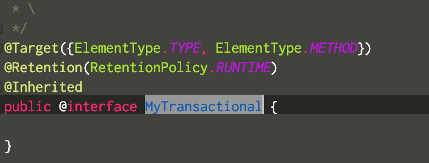
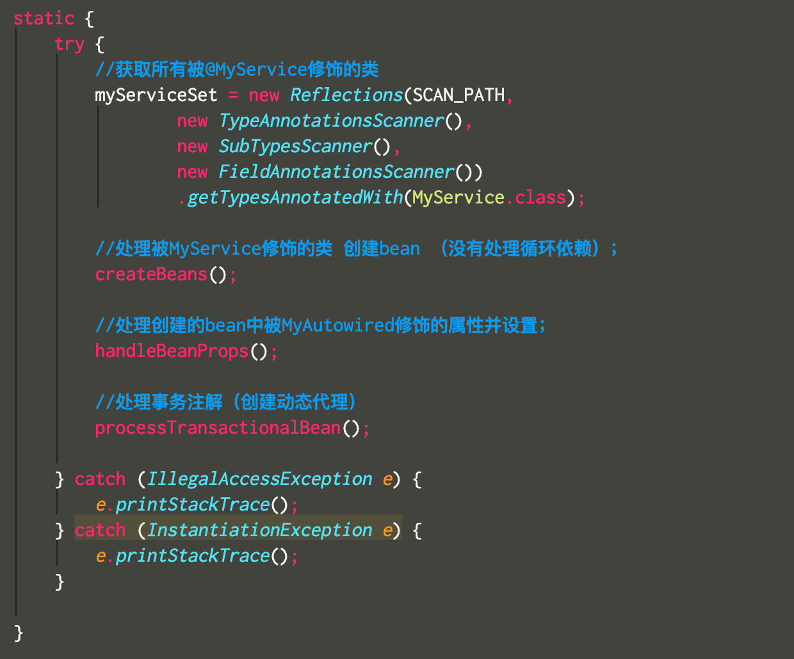
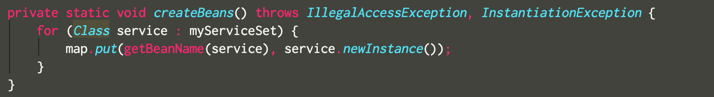
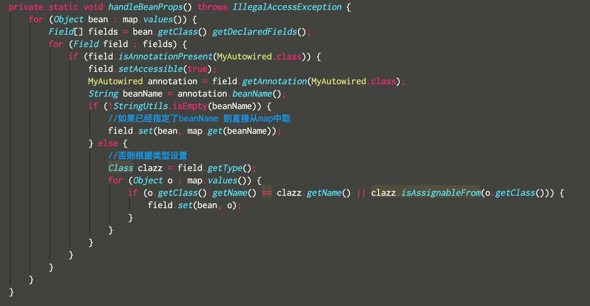
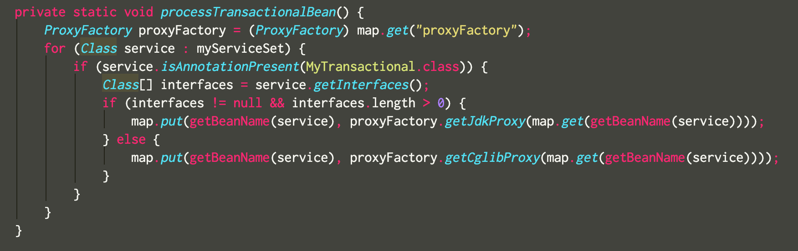
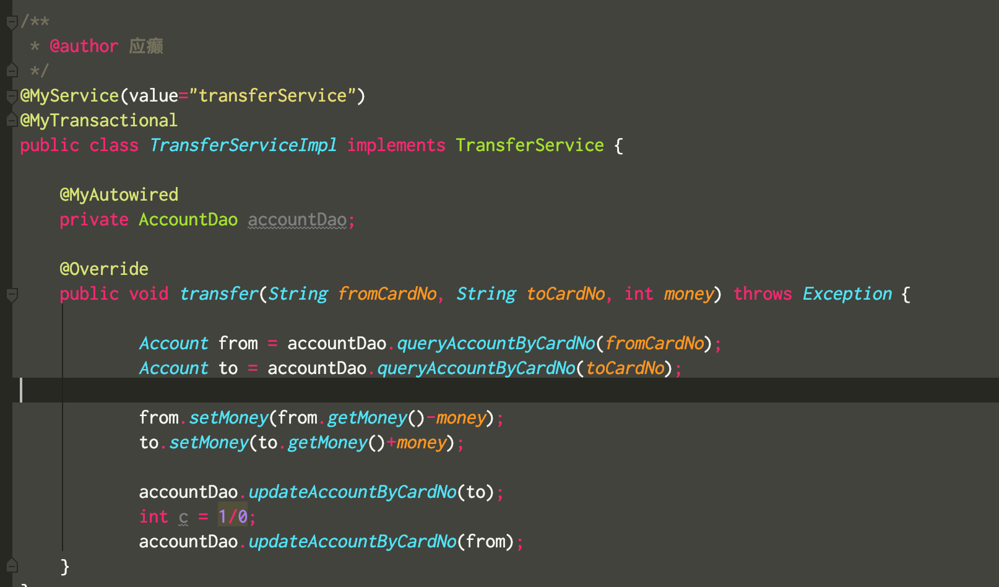

> Spring 题目
>
> 1、学员自定义@Service、@Autowired、@Transactional注解类，完成基于注解的IOC容器（Bean对象创建及依赖注入维护）和声明式事务控制，写到转账工程中，并且可以实现转账成功和转账异常时事务回滚
>
> 注意考虑以下情况：
>
>  1）注解有无value属性值【@service（value=""@Repository（value=""）】 
>
>  2）service层是否实现接口的情况【jdk还是cglib】

**代码说明**

### 1.定义相关注解类

	#### 1.1 @MyAutowired

 

#### 1.2 @MyService

#### 1.3 @MyTransactional

### 2. 创建注解BeanFactory--AnnotationBeanFactory

#### 2.1 AnnotationBeanFactory 说明

静态代码块中主要包含3个方法。

1. createBeans() 创建被@MyService修饰的对象bean。

2. handleBeanProps() 为被@MyAutowired修饰的属性赋值
3. processTransactionBean() 为被@MyTransactional修饰的bean对象创建代理对象并替换到map中

以下是方法详细说明

- createBeans() 遍历所有被@MyService修饰的类，并使用反射创建实例放入map中

- handleBeanProps()  遍历map中所有的bean 如果bean中有被@MyAutowired修饰的属性，如果设置了beanName则直接从map中获取对应的bean并设置，如果没有设置，则根据属性的类型从map中获取符合的实例并赋值

- processTransactionBean()遍历所有被@MyTransactional修饰的类，并创建动态代理类，如果该类实现了接口则使用jdk动态代理，如果没有则使用cglib动态代理。并使用动态代理类覆盖map中通过反射生成的实例。

### 3.应用测试

实际测试过程符合预期，删除了原有的xml方式的BeanFactory类。转账功能正常，transfer方法受到事务的控制，当异常发生时。数据收到事务保护

